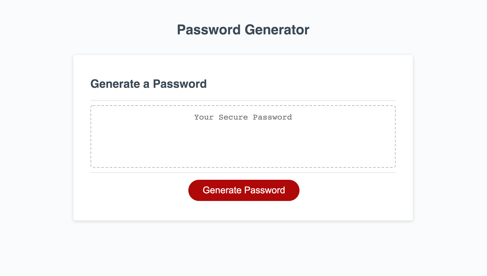

<!-- Badges -->
     

# Password Generator 

[carolynmary.github.io/password-generator](https://carolynmary.github.io/password-generator)
 
- - -
- - -
### Create a strong password with this application that randomly generates a code according to your selected options.
- - -
- - -
  
## How to Use 

Click the "Generate Password" button and follow the prompts.

## License
    
The code is licensed under the [MIT](https://choosealicense.com/licenses/mit/) License.
  
## Questions & Feedback
  
Have a question or feedback? Send me a note or just say hi, I'd be happy to hear from you!
  
> “Knowledge is having the right answer. Intelligence is asking the right question.” ~ Unknown
  
Email: carolyn@carolynmary.com  
  
GitHub: [carolynmary](https://github.com/carolynmary)  
  
Porfolio: [carolynmary.com](https://carolynmary.com) 
  
 

© 2020 Carolyn Mary Stolze